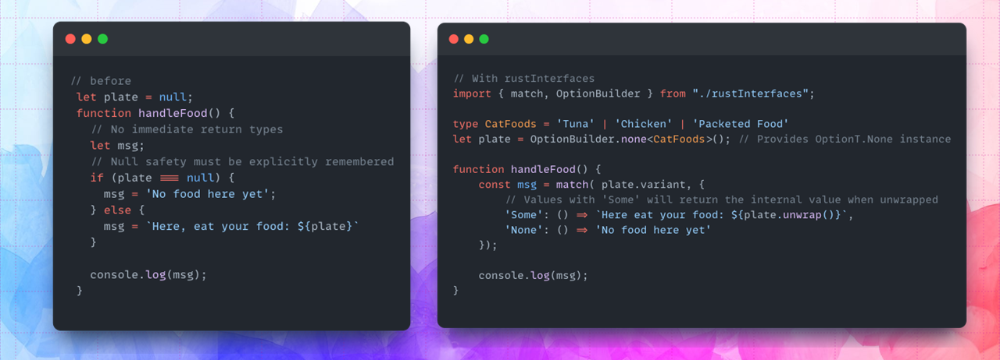

<h1 align=center> Rust Interfaces </h1>

Are you a Rustacean who also codes in TypeScript? And do you feel like 
TypeScript doesn't provide the same feeling of safety that Rust does?

You aren't alone. This is a common feeling that TypeScript-coding Rustaceans feel. 
We miss the feeling of coding in Rust wherever we go, and we're right to miss them 
the way we do.

That's why this repo aims to implement a kind of _interface_ that attempts to bridge 
the advantages that Rust brings to the table into the world of TypeScript.



Inspired by [this shorts video](https://www.youtube.com/shorts/3iWoNJbGO2U), I feel like it would be
a quality of life advantage to have this feature addressed.

# Setup
1. Copy the `rustInterfaces.ts` file into your environment wherever you want to use it.
2. Remove the `import { DOMParser, Document }` statement if you are using it in client-side code or non-deno code

**Optional:** Rename it to have the `tsx` extension if you want to include JSX.


# Features
## `match`
Enables you to evaluate a value with multiple patterns and then run code depending on which pattern corresponds.

```ts
import { match } from "./rustInterfaces";

type Animal = {
    // String-based discriminated unions can always use `match`
    kind: 'Land' | 'Water',
    name: string
}

const pet: Animal = {
    kind: 'Land',
    name: 'Alex the cat'
}

// This is where the match statement happens, notice how you can get a return value unlike `switch` statements
const instruction = match( pet.kind, {
    // You can either put a directly-addressed value
    'Water': () => `Place ${pet.name} in the tank`,

    // Or you can write program logic to compute special cases
    'Land': () => {
        if (pet.name === 'Alex the cat') {
            console.log('Legendary animal found!');
        }
        return `Put ${pet.name} on the ground`;
    }

    // If all values are not matched, the linter will detect it
});

console.log(`What you should do: ${instruction}`);
// Prints "What you should do: Put Alex the cat on the ground"
```

## `OptionT<T>`
A replacement of `null`. Allows the user to safely handle variables that may initially have no value.

This type is best instantiated using the `OptionBuilder` type.

### Usage
```ts
import { match, OptionBuilder } from "./rustInterfaces";

type CatFoods = 'Tuna' | 'Chicken' | 'Packeted Food'
let plate = OptionBuilder.none<CatFoods>(); // Provides OptionT.None instance

function handleFood() {
    const msg = match( plate.variant, {
        // Values with 'Some' will return the internal value when unwrapped
        'Some': () => `Here eat your food: ${plate.unwrap()}`,
        'None': () => 'No food here yet'
    });

    console.log(msg);
}

handleFood() // Prints 'No food here yet'

// To update the option value you can use
plate = OptionBuilder.some<CatFoods>('Tuna');

handleFood(); // Prints 'Here eat your food: Tuna'

// If you don't want to exhaustively check, you can still make safe `if`
// statements
let msg = 'Should not be printed';
if (plate.variant === 'Some' && plate.unwrap() === 'Tuna') {
    msg = "That sounds fishy!"
}

console.log(msg); // Prints 'That sounds fishy!'
```

## `Result<T, K>`
Not all errors necessitate the complete halt of a program. There are instances where a function’s failure is due to an issue that can be readily understood and addressed.

The `Result<T, K>` construct is designed to manage scenarios where a program encounters a failure that is not critical.

You can use `match` on `resultVariable.variant` to get either:
- `Ok`: the function call successfully worked, or
- `Err`: the function call failed

allowing your code to decide what to do in each scenario.

While both variants can use `resultVariable.unwrap()`, it is recommended to not use it knowingly before `resultVariable.variant` has been confirmed to be a `'Some'` value

Examples will be shown below in `parsers`.

## `parsers`
Provides functions that safely execute and return the `Result<T, K>` variants of in-built parsing.

### `parsers.parseHtml`
Parses a HTML string. Returns either:
#### Success-case: `Result.Ok<Doc>`
```ts
{
    variant: 'Ok',
    unwrap: fn() => Doc
}
```
Where `Doc` is a [HTML document](https://developer.mozilla.org/en-US/docs/Web/API/HTMLDocument) element

#### Failure-case: `Result.Err`
Representing that the html string could not be parsed
```ts
{
    variant: 'Err',
    unwrap: fn() => never // Panics in this case
}
```

#### Usage:
```ts
import { match, parsers } from "./rustInterfaces";

const exampleHtmlString = '<h1> You are safe </h1>';
const htmlRes = parsers.parseHtml(exampleHtmlString);
const msg = match( htmlRes.variant, {
    'Ok': () => {
        // Safe to unwrap over here due to being `Ok` checked
        const doc = htmlRes.unwrap() as Document
        const message = doc.documentElement
            ? doc.documentElement.textContent.trim()
            : 'Nothing';
        return `Found message: ${message}`;
    },
    'Err': () => 'No message found'
})

console.log(msg); // Prints 'Found message: You are safe'
```

### `parsers.parseJSON<T>`
Parses a JSON string. Returns either:
#### Success-case: `Result.Ok<T>`
```ts
{
    variant: 'Ok',
    unwrap: fn() => T
}
```
Where `T` is a user-defined object

#### Failure-case: `Result.Err`
```ts
{
    variant: 'Err',
    unwrap: fn() => never // Panics in this case
}
```

#### Usage:
```ts
import { match, parsers } from "./rustInterfaces";

const jsonStr = `
{
    "name": "Jungle",
    "population": 3000
}`

interface Habitat {
    name: string,
    population: number
}
const jsonRes = parsers.parseJSON<Habitat>(jsonStr)
const msg = match( jsonRes.variant, {
    'Ok': () => {
        const {name, population} = jsonRes.unwrap();
        return `${name} found with ${population} animals`;
    },
    'Err': () => 'Habitat parsing failed'
})

console.log(msg); // Prints 'Jungle found with 3000 animals'
```

## `net`
Provides functions that safely execute in-built net-based operations.

### `net.fetch<T>`
Executes a fetch operation to get data from a back-end server as a `Result`

#### Success-case: `Result.Ok<T>`
```ts
{
    variant: 'Ok',
    unwrap: fn() => T
}
```
Where `T` is a user-defined object

#### Failure-case: `Result.Err<'FetchError' | 'ResponseError'>`
If the response can't be received, it returns:
```ts
{
    variant: 'Err',
    errKind: 'FetchError',
    unwrap: fn() => never // Panics in this case
}
```

If the response is received but the response status is not `.ok`, it returns:
```ts
{
    variant: 'Err',
    errKind: 'ResponseError',
    unwrap: fn() => never // Panics in this case
}
```

#### Usage:
```ts
import { match, net } from "./rustInterfaces";

interface Elephant {
    name: string
    trunkLength: number
}
const url = 'http://nocodepanda.com/neofetch'

function logRes() {
    const elephantRes = await net.fetch<Elephant>(url);
    if (elephantRes.variant === 'Ok') {
        const elephantVals = JSON.stringify(elephantRes.unwrap());
        console.log('Found elephant data with values:\n'.concat(elephantVals));
        return;
    }

    // Early returns allows Result types to be inferred more precisely.
    // In this case, it's inferred to be of type Result.Err<'FetchError' | `ResponseError`>
    const msg = match( elephantRes.errKind, {
        'FetchError': () => 'could not be received',
        'ResponseError': () => 'was received but did not give `.ok`',
    })

    const dbgMessage = `Could not fetch because the response ${msg}`
    console.log(dbgMessage);
}

logRes(); // Prints 'Could not fetch because the response could not be received'
```
